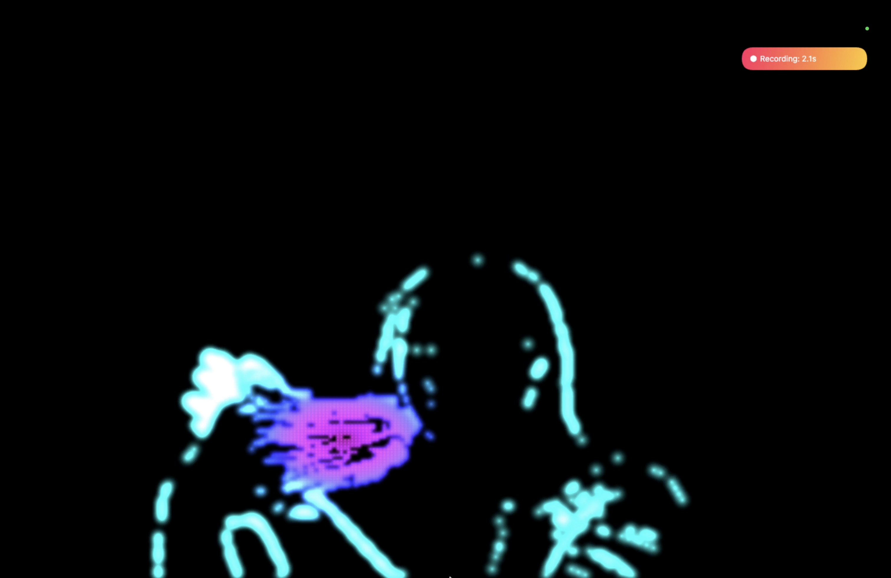
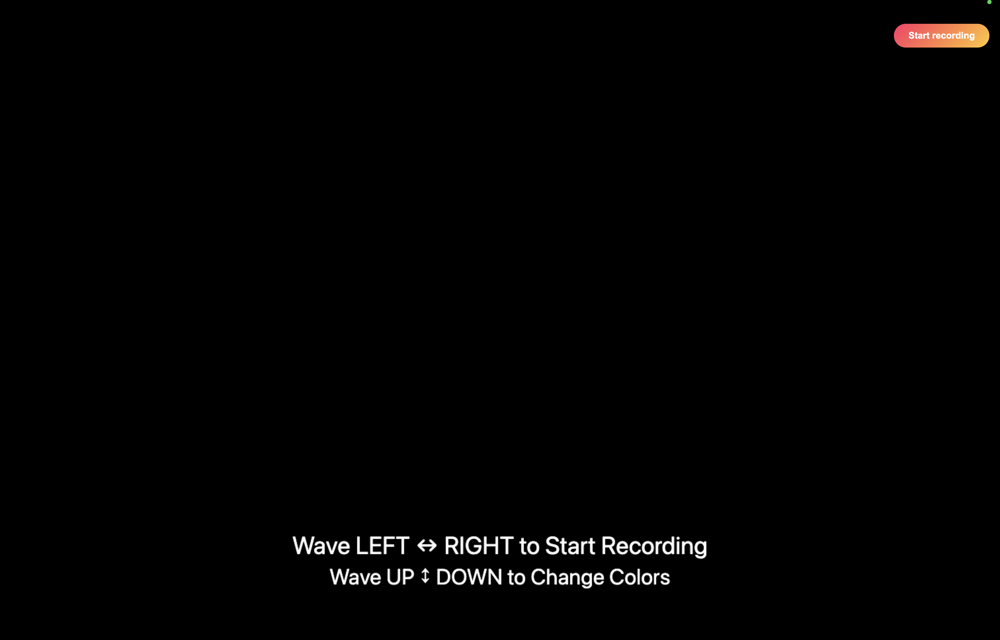
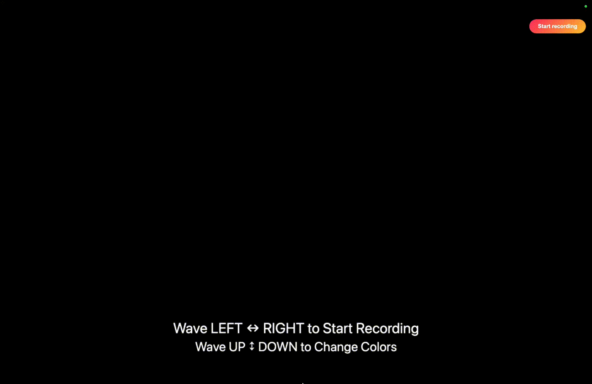

# 🎨 ColorMotion Recorder

**ColorMotion Recorder** is an interactive, web-based digital art installation that transforms live movement into a **real-time colored silhouette**.

## Demo Video
[Download to view the full demo](record/demo/demo_video.mp4)

## Try It Live!

https://yanzi01.github.io/ColorMotion_Recorder/record/index.html

>For best performance, use Chrome on a desktop

---
## 🕹 How to Use
1.	Stand in front of the camera
2.	Move your hand close to the camera
3.	Wave UP ↕ DOWN to change color palettes
4.	Wave LEFT ↔ RIGHT to start recording
5.	A 3-second countdown begins
6.	Perform any motion you like during recording (5s)
7.	Watch your motion replay as abstract color art
8.	Repeat and explore
---

## Features

- **Fully motion-controlled interaction**
  - **Added Wave UP & DOWN** -> Change color palette (10 variations)
  - **Added Wave LEFT & RIGHT** -> Start a 5 seonds recording
    
- **Motion design**
  - Human movement is rendered as a colorful silhouette instead of real video
  - Filters out small movements such as breathing and lighting noise
  - Prevents accidental triggers from people walking past the camera

- **Automatic playback**
  - After recording, the silhouette animation replays automatically

- **Button fallback for accessibility**
  - A visible **Start Recording** button is always available
  - Ensures accessibility by allowing others to help start the interaction if the user is unable to perform the wave left & right to start
  - And act as a backup if motion detection fails to start

---

## How It Works

### 1. Camera Access (WebRTC)
The browser requests webcam access using `getUserMedia`.  
The video stream is processed internally and **never displayed**.

### 2. Motion Detection
Consecutive video frames are compared using pixel-level luminance differences.  
Only significant changes are treated as motion, filtering out camera noise.

### 3. Silhouette Generation
Motion pixels are rendered as glowing color particles using the Canvas 2D API.  
Colors are mapped by distance from the motion center, naturally highlighting hands and fingers.

### 4. Gesture Recognition
- **Horizontal hand waves** start recording
- **Vertical hand waves** change color palettes

### 5. Recording & Playback
- Only the **art canvas** is recorded using the MediaRecorder API
- UI overlays are rendered on a separate canvas and excluded from recordings
- Playback runs at normal speed

---

### Screenshot

**Live Color Silhouette**



---

### Instruction Panel

**Idle screen showing gesture instructions**



---

### Demo Videos

- **Recording**
  [record/demo/record.gif](record/demo/record.gif)

- **Wave LEFT ↔ RIGHT to Start Recording**  
  

- **Wave UP ↕ DOWN to Change Color Palette**  
  
---

## How to Run Locally

Camera access requires **HTTPS or localhost**.

### Clone the repository

```bash
git clone https://github.com/your-username/your-repo-name.git
cd your-repo-name
```

### Start a local server

```bash
python3 -m http.server 8000
```

Then open the project in your browser:

```bash
http://localhost:8000/record/index.html
```

Allow camera access when prompted.

Notes
	•	Movement interaction requires a webcam
	•	The project will not work if opened directly as a local file
	•	Use Chrome for best results

⸻

Project Context

This project was created as an interactive digital art, inspired by motion based installations found in WNDR Museum.

The goal is to explore how human movement can become a visual language, transforming everyday movement into digital artwork.

---

## Documentation References

- **WebRTC – `navigator.mediaDevices.getUserMedia`**  
  Used to access the user’s webcam for live motion capture.  
  https://developer.mozilla.org/en-US/docs/Web/API/MediaDevices/getUserMedia  

- **HTML5 Canvas 2D API**  
  Used to draw motion-based silhouettes, pixels, gradients, and color effects.  
  https://developer.mozilla.org/en-US/docs/Web/API/Canvas_API  

- **MediaRecorder API**  
  Used to record and replay the generated canvas artwork.  
  https://developer.mozilla.org/en-US/docs/Web/API/MediaRecorder  

- **Canvas Capture Stream – `HTMLCanvasElement.captureStream()`**  
  Used to capture the canvas as a video stream for recording.  
  https://developer.mozilla.org/en-US/docs/Web/API/HTMLCanvasElement/captureStream  

- **Animation Loop – `requestAnimationFrame`**  
  Used to drive real-time animation and motion analysis.  
  https://developer.mozilla.org/en-US/docs/Web/API/window/requestAnimationFrame  

- **JavaScript (ES6)**  
  Used for logic, state management, and interaction handling.  
  https://developer.mozilla.org/en-US/docs/Web/JavaScript  

- **ChatGPT (OpenAI)**  
  Used as a development assistant for documentation guidance, implementation support, and troubleshooting.  
  https://platform.openai.com/docs  
  https://openai.com/chatgpt
---

## Credits

- WebRTC (`getUserMedia`)
- HTML5 Canvas 2D API
- MediaRecorder API
- JavaScript (ES6)
- ChatGPT (OpenAI)
---

## License

This project is intended for educational and artistic purposes.

---


